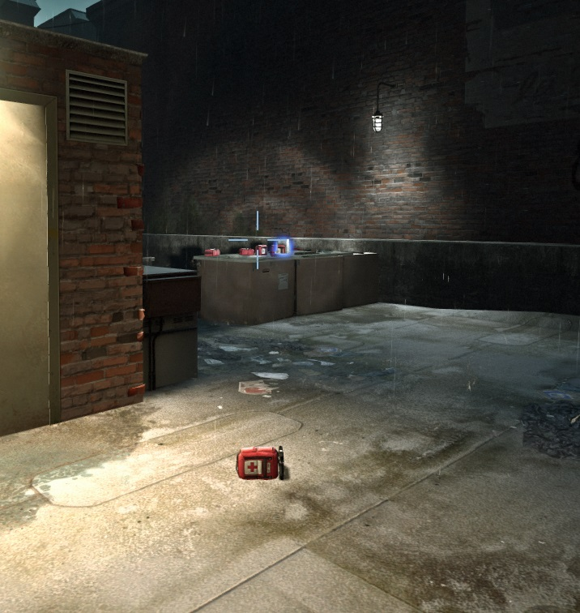
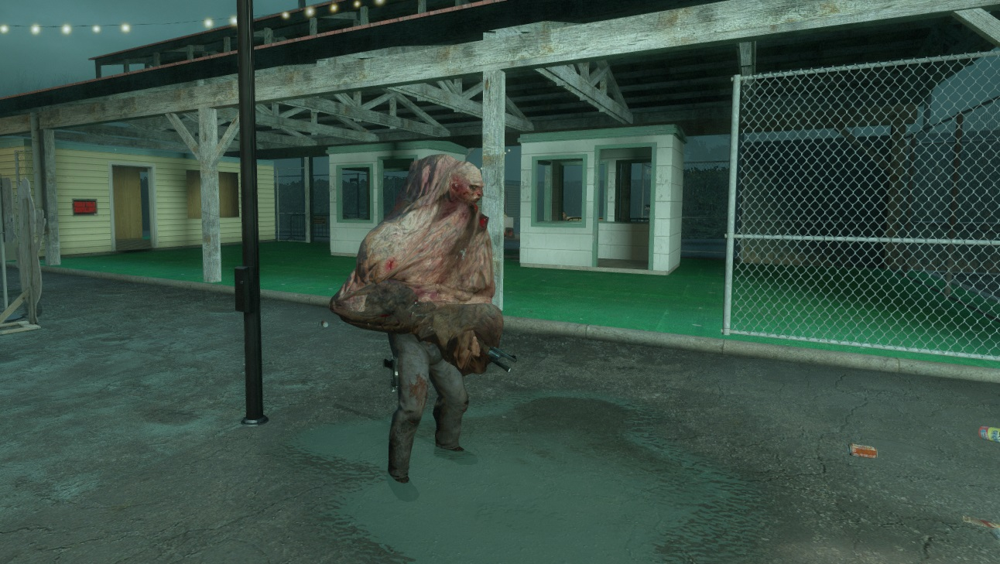

# Description | 內容
Player can become the model you point at.

> __Note__ <br/>
This plugin is private, Please contact [me](https://github.com/fbef0102/Game-Private_Plugin#私人插件列表-private-plugins-list)<br/>
此為私人插件, 請聯繫[本人](https://github.com/fbef0102/Game-Private_Plugin#私人插件列表-private-plugins-list)

* [Video | 影片展示](https://youtu.be/dKdnKxFNUXk)

* <details><summary>Image | 圖示</summary>

	<br/>
	<br/>
	<br/>
	<br/>
	<br/>
	<br/>
	<br/>
</details>

* <details><summary>How does it work?</summary>

	* Point an entity -> type !modme in chatbox -> your model will be changed into the same as the entity -> have fun!
</details>

* Require | 必要安裝
    1. [[INC] Multi Colors](https://github.com/fbef0102/L4D1_2-Plugins/releases/tag/Multi-Colors)
	2. [ThirdPersonShoulder_Detect](https://forums.alliedmods.net/showthread.php?t=298649)

* <details><summary>ConVar | 指令</summary>

	* cfg/sourcemod/l4d_modme.cfg
		```php
		// 0=Plugin off, 1=Plugin on.
		l4d_modme_enable "1"

		// Players with these flags have access to use command. (Empty = Everyone, -1: Nobody)
		l4d_modme_access_flag ""
		```
</details>

* <details><summary>Command | 命令</summary>

	* **Point an entity or infected and replace your model with their model**
		```php
		sm_modme
		```
</details>

* Apply to | 適用於
	```
	L4D1
	L4D2
	```

* Translation Support | 支援翻譯
	```
	English
	繁體中文
	简体中文
	```

* <details><summary>Changelog | 版本日誌</summary>

	* v1.0 (2023-4-8)
	    * Initial Release
</details>

- - - -
# 中文說明
玩家外觀可以變成地圖任何一個物件模型

* 原理
	* 對準一個物件然後輸入!modme，你的模型將變成物件的模型
	* 可以複製特感、Tank、Witch、普通感染者的模型，
		* Charger與Spitter 的模型會卡住，認真你就輸了

* <details><summary>指令中文介紹 (點我展開)</summary>

	* cfg/sourcemod/l4d_modme.cfg
		```php
		// 0=關閉插件, 1=啟動插件
		l4d_modme_enable "1"
		
		// 擁有這些權限的玩家，才可以輸入!modme (留白 = 任何人都能, -1: 無人)
		l4d_modme_access_flag ""
		```
</details>